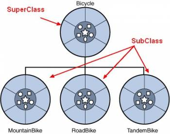

# Κληρονομικότητα

Κάθε κλάση που κληρονομεί από μία άλλη κλάση ονομάζεται υποκλάση (subclass) της γονικής κλάσης από την οποία κληρονομεί. Αντίστοιχα, η γονική κλάση ονομάζεται υπερκλάση (superclass) της κληρονομούμενης κλάσης.



Όπως φαίνεται και στο παραπάνω σχήμα μία κλάση (subclass) μπορεί να κληρονομεί ΜΟΝΟ ΜΙΑ άλλη κλάση. Αντίστροφα μία κλάση (superclass) μπορεί να κληρονομείται από πολλές διαφορετικές κλάσεις. Παρακάτω δίνουμε ένα παράδειγμα κληρονομικότητας χρησιμοποιώντας την κλάση του ποδηλάτου που είδαμε και προηγούμενα.

### Bicycle.java

```java
public class Bicycle {
    
  private int cadence;
  private int gear;
  private int speed;
     
  public Bicycle(int startCadence, int startSpeed, int startGear) {
    gear = startGear;
    cadence = startCadence;
    speed = startSpeed;
  }
  
  public int getCadence() {
      return cadence;
  }
  
  public int getGear() {
      return gear;
  }
  
  public int getSpeed() {
      return speed;
  }

  public void setCadence(int newValue) {
    cadence = newValue;
  }
    
  public void setGear(int newValue) {
    gear = newValue;
  }
  
  public void setSpeed(int newSpeed) {
	speed = newSpeed;
  }
    
  public void applyBrake(int decrement) {
    speed -= decrement;
  }
    
  public void speedUp(int increment) {
    speed += increment;
  }
  
  public String toString() {
     return "Gear: "+gear+", Cadence: "+cadence+", Speed: "+speed;
  }   
}
```

### MountainBike.java

```java
public class MountainBike extends Bicycle {

  private int seatHeight;

  // the MountainBike subclass has
  // one constructor
  public MountainBike(int startCadence,
            int startSpeed, int startGear, int startHeight) {
    super(startCadence, startSpeed, startGear);
    seatHeight = startHeight;
  }
  
  public MountainBike(Bicycle bicycle, int startHeight) {
    super(bicycle.getCadence(), bicycle.getSpeed(), bicycle.getGear());
    seatHeight = startHeight;
  }
    
  // the MountainBike subclass has
  // one method
  public void setHeight(int newValue) {
    seatHeight = newValue;
  }
  
  public int getSeatHeight() {
    return seatHeight;
  }
  
  public String toString() {
     return super.toString() + ", Seat Height: "+seatHeight;
  }
}
```

Παρακάτω βλέπετε ένα παράδειγμα χρήσης των κλάσεων **Bicycle** και **MountainBike**.

### RunBike.java

```java
public class RunBike {
  public static void main(String args[]) {
    Bicycle myBicycle = new Bicycle(10, 20, 30);
    MountainBike myBike = new MountainBike(11,22,33, 45);
    MountainBike yourBike = new MountainBike(myBicycle, 35);
 
    System.out.println("[myBicycle] "+myBicycle);
    System.out.println("[myBike]    "+myBike);
    System.out.println("[yourBike]  "+yourBike);
  }
}
```

## Προσβασιμότητα των κληρονομούμενων πεδίων

Μία κλάση η οποία κληρονομεί μία άλλη κλάση έχει πρόσβαση στα μέλη (πεδία και μεθόδους) της κλάσης αυτής ως εξής:

- **Έχει** πρόσβαση στα *public* μέλη της γονικής κλάσης.
- **Δεν έχει** πρόσβαση στα *private* μέλη της κλάσης.

Αν υπάρχουν *public* μέθοδοι οι οποίες επιτρέπουν την πρόσβαση σε *private* πεδία, τότε αυτές μπορούν να χρησιμοποιηθούν για τον ορισμό ή για την λήψη της τιμής τους.

## Άσκηση 2

Δημιουργήστε ξανά την κλάση [RectangularCuboid](../askisi1/README.md) που φτιάξατε προηγούμενα με την βοήθεια της κλάσης **Rectangle** που δίνεται παρακάτω. Συγκεκριμένα, η κλάση **RectangularCuboid** θα πρέπει να κληρονομεί την κλάση **Rectangle**. Η κλάση **TryRectangularCuboid.java** (που επίσης δημιουργήσατε προηγούμενα) θα πρέπει να δουλεύει και με την νέα έκδοση της κλάσης **RectangularCuboid** που μόλις δημιουργήσατε.

### Rectangle.java

```java
public class Rectangle {
  private int width, height;
 
  public Rectangle(int w, int h) {
    width = w;
    height = h;
  }
 
  public void setHeight(int h) {
     height = h;
  }
 
  public void setWidth(int w) {
     width = w;
  }
 
  public int getHeight() {
     return height;
  }
 
  public int getWidth() {
     return width;
  }
 
  public String toString() {
    return "height: "+height+", width: "+width;
  }
}
```